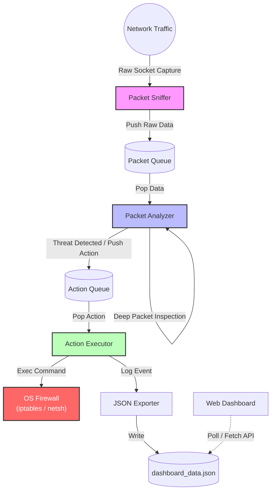

# Grid Watcher IPS 🛡️

**Grid Watcher** adalah sistem *Intrusion Prevention System* (IPS) ringan yang dirancang khusus untuk melindungi infrastruktur SCADA. Sistem ini memantau lalu lintas jaringan secara *real-time*, mendeteksi anomali protokol Modbus TCP, serta mengenali aktivitas *port scanning*, dan secara otomatis memblokir IP penyerang melalui firewall sistem operasi.

## 🏗️ Architecture

Sistem ini menggunakan arsitektur *multi-threaded pipeline* untuk memastikan pemrosesan paket berkecepatan tinggi tanpa memblokir pengambilan data.



## ✨ Features

* **SCADA Protection**: Mendeteksi dan mencegah perintah tulis Modbus (Function Codes `0x05`, `0x06`, `0x10`) yang tidak sah.
* **Port Scan Detection**: Mengenali pola *SYN scan* horizontal dan vertikal.
* **Active Defense**: Integrasi langsung dengan `iptables` (Linux) atau `netsh` (Windows) untuk memblokir IP penyerang secara instan.
* **Real-time Dashboard**: Antarmuka web berbasis HTML5/JS untuk memvisualisasikan ancaman dan status sistem.
* **Cross-Platform**: Kompatibel dengan Linux (Production) dan Windows (Development/Compatibility Mode).

## 📋 Prerequisites

* **C++ Compiler**: Mendukung standar C++23 (MSVC, GCC, atau Clang).
* **CMake**: Versi 3.20 atau lebih baru.
* **Python 3**: Untuk menjalankan server dashboard lokal.
* **Permissions**: Akses Administrator/Root diperlukan untuk *raw socket* dan manipulasi firewall.

## 🛠️ Installation & Build

1. **Clone repository**
```bash
git clone [https://github.com/zuudevs/grid_watcher.git](https://github.com/zuudevs/grid_watcher.git)
cd grid_watcher

```


2. **Generate Build Files**
```bash
cmake -S . -B build

```


3. **Compile**
```bash
cmake --build build --config Release

```


## 🚀 Usage Guide

### 1. Menjalankan Core IPS

Aplikasi harus dijalankan dengan hak akses administrator karena menggunakan *Raw Sockets*.

**Windows (Run as Administrator):**

```cmd
.\bin\grid_watcher.exe

```

**Linux (Sudo):**

```bash
sudo ./bin/grid_watcher

```

### 2. Menjalankan Dashboard

Buka terminal baru, masuk ke folder `www`, dan jalankan server HTTP sederhana.

```bash
cd www
python -m http.server 8080

```

Buka browser dan akses `http://localhost:8080`.

### 3. Simulasi Serangan (Optional)

Untuk menguji sistem, gunakan tool simulasi serangan yang tersedia:

```bash
./bin/attack_sim <TARGET_IP>

```

## ⚠️ Disclaimer

Aplikasi ini dibuat untuk tujuan edukasi dan penelitian keamanan jaringan SCADA. Penulis tidak bertanggung jawab atas penggunaan alat ini untuk kegiatan ilegal. Pastikan Anda memiliki izin sebelum memantau jaringan.

## 📄 License

Project ini dilisensikan di bawah [MIT License](https://www.google.com/search?q=LICENSE).

---

**Author:** Zuudevs

**Version:** 1.0.0