# System Architecture Documentation

**Grid Watcher IPS - Version 1.0.0**

This document provides an in-depth technical overview of Grid Watcher's architecture, design decisions, and implementation details.

---

## 📋 Table of Contents

- [High-Level Overview](#high-level-overview)
- [Component Architecture](#component-architecture)
- [Data Flow](#data-flow)
- [Concurrency Model](#concurrency-model)
- [Platform Differences](#platform-differences)
- [Performance Characteristics](#performance-characteristics)
- [Security Architecture](#security-architecture)
- [Deployment Models](#deployment-models)

---

## 🏗️ High-Level Overview

Grid Watcher uses a **multi-threaded pipeline architecture** based on the Producer-Consumer pattern. This design ensures high throughput, low latency, and clean separation of concerns.

### System Architecture Diagram

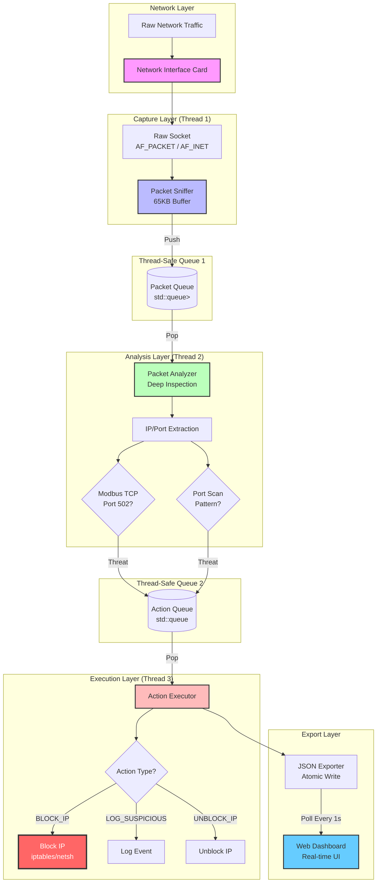

---

## 🧩 Component Architecture

### 1. Packet Sniffer (Producer)

**Responsibility:** Capture raw network packets from the NIC

**Key Characteristics:**
- **Non-blocking:** Uses raw sockets with minimal processing
- **Buffer Size:** 65536 bytes (1 MTU)
- **Platform-Specific:** Different implementations for Linux/Windows

**Class Diagram:**

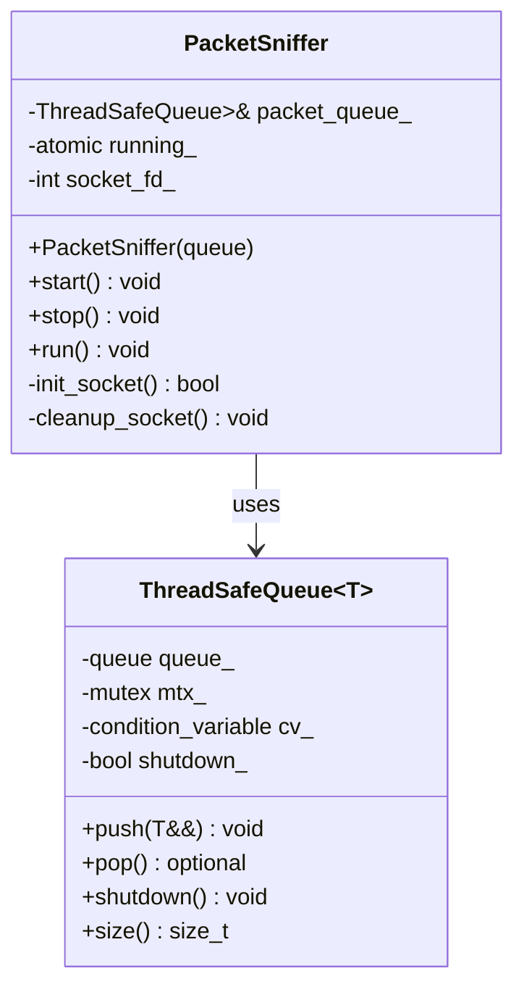

**Pseudo-code:**
```cpp
void PacketSniffer::run() {
    vector<uint8_t> buffer(65536);
    
    while (running_) {
        ssize_t bytes = recv(socket_fd_, buffer.data(), buffer.size(), 0);
        
        if (bytes > 0) {
            vector<uint8_t> packet(buffer.begin(), buffer.begin() + bytes);
            packet_queue_.push(std::move(packet));  // Zero-copy move
        }
    }
}
```

---

### 2. Packet Analyzer (Processor)

**Responsibility:** Perform deep packet inspection and threat detection

**Detection Algorithms:**

#### A. Modbus TCP Detection

**Flow Diagram:**

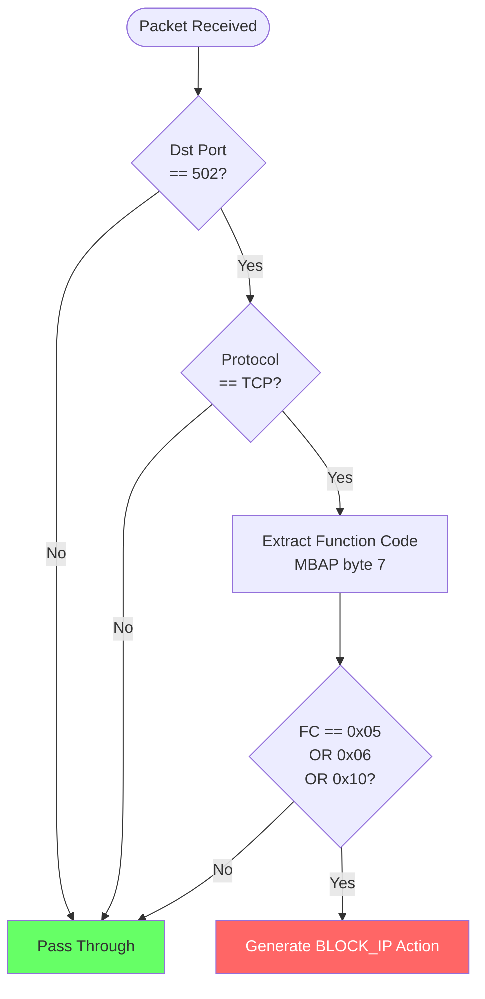

**Modbus Packet Structure:**
```
┌──────────────────────────────────────┐
│  Ethernet Header (14 bytes)          │
├──────────────────────────────────────┤
│  IP Header (20+ bytes)                │
├──────────────────────────────────────┤
│  TCP Header (20+ bytes)               │
├──────────────────────────────────────┤
│  MBAP Header (7 bytes)                │
│  ┌─────────────────────────────────┐ │
│  │ Transaction ID   (2 bytes)      │ │
│  │ Protocol ID      (2 bytes)      │ │
│  │ Length           (2 bytes)      │ │
│  │ Unit ID          (1 byte)       │ │
│  └─────────────────────────────────┘ │
├──────────────────────────────────────┤
│  Function Code (1 byte) ◄─── CHECK  │
│  Data...                              │
└──────────────────────────────────────┘
```

---

#### B. Port Scan Detection

**Algorithm: Sliding Window with Threshold**

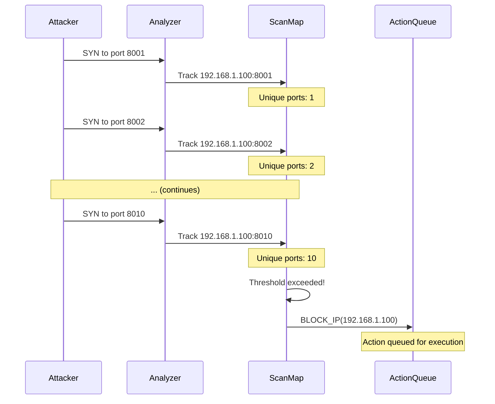

**Data Structure:**
```cpp
struct ScanTracker {
    unordered_map<uint16_t, int> port_attempts;  // port -> count
    chrono::steady_clock::time_point last_seen;
};

unordered_map<string, ScanTracker> scan_map_;  // ip -> tracker
```

**Complexity:**
- **Time:** O(1) insert, O(m) check (m = ports attempted)
- **Space:** O(n×m) where n = unique IPs, m = ports per IP

---

### 3. Action Executor (Consumer)

**Responsibility:** Execute threat mitigation actions

**State Machine:**

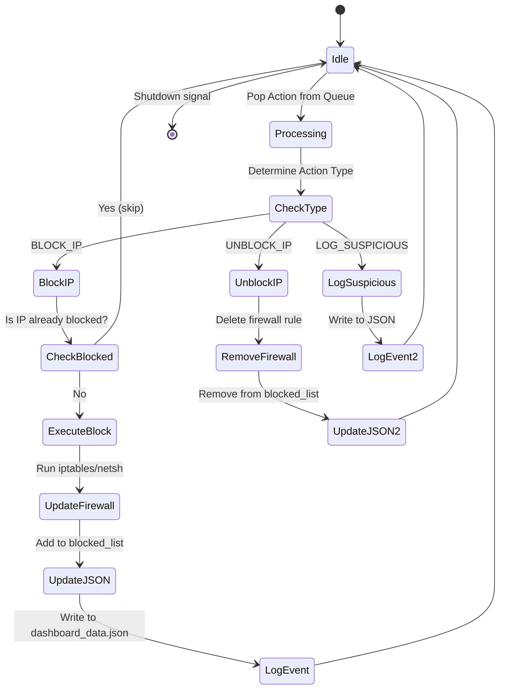

---

## 🔄 Data Flow

### Complete Pipeline Flow

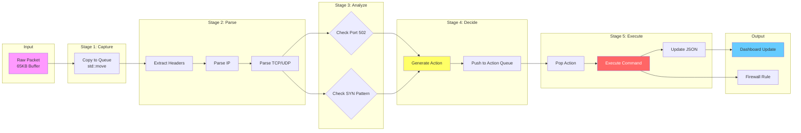

---

## ⚙️ Concurrency Model

### Thread Architecture

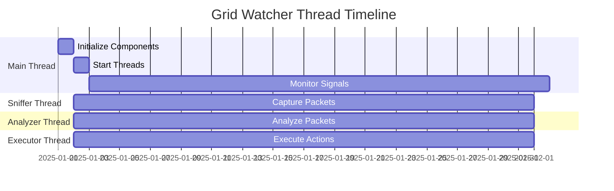

### Thread Communication

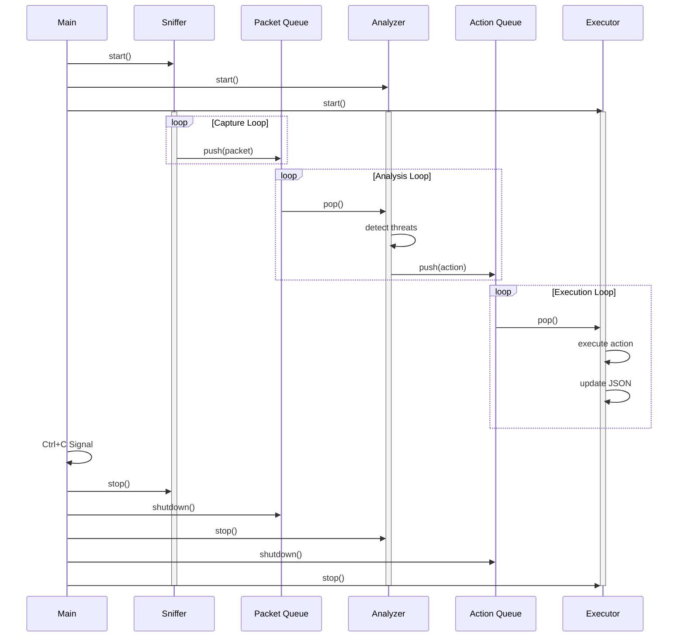

### Synchronization Primitives

| Component | Primitive | Purpose |
|-----------|-----------|---------|
| ThreadSafeQueue | `std::mutex` | Protect queue operations |
| ThreadSafeQueue | `std::condition_variable` | Block on empty queue |
| ActionExecutor | `std::mutex` | Protect blocked IP set |
| Logger | `static std::mutex` | Serialize log writes |
| JsonExporter | `std::mutex` | Atomic JSON writes |

---

## 🖥️ Platform Differences

### Linux vs Windows

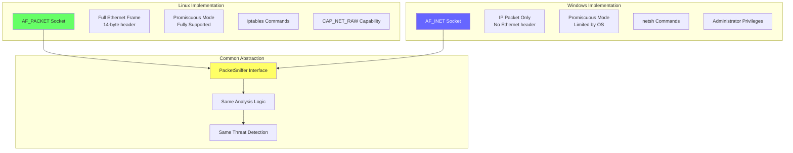

**Header Offset Handling:**
```cpp
static constexpr size_t get_ip_offset() {
#ifdef _WIN32
    return 0;  // Windows: starts at IP header
#else
    return 14; // Linux: skip Ethernet header
#endif
}
```

---

## ⚡ Performance Characteristics

### Throughput Analysis

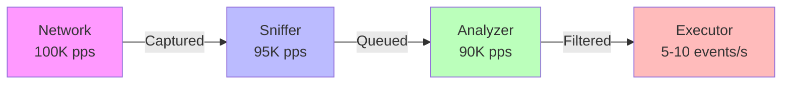

**Bottleneck Analysis:**
- **Sniffer:** Limited by kernel socket buffer
- **Analyzer:** CPU-bound (packet parsing)
- **Executor:** I/O-bound (firewall commands)

### Memory Profile

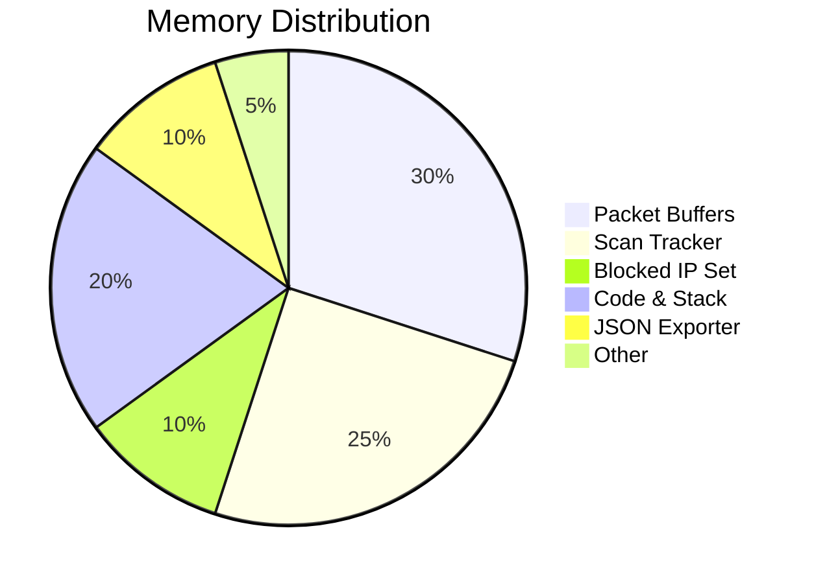

**Total:** ~50 MB typical, ~100 MB peak

---

## 🔒 Security Architecture

### Privilege Separation

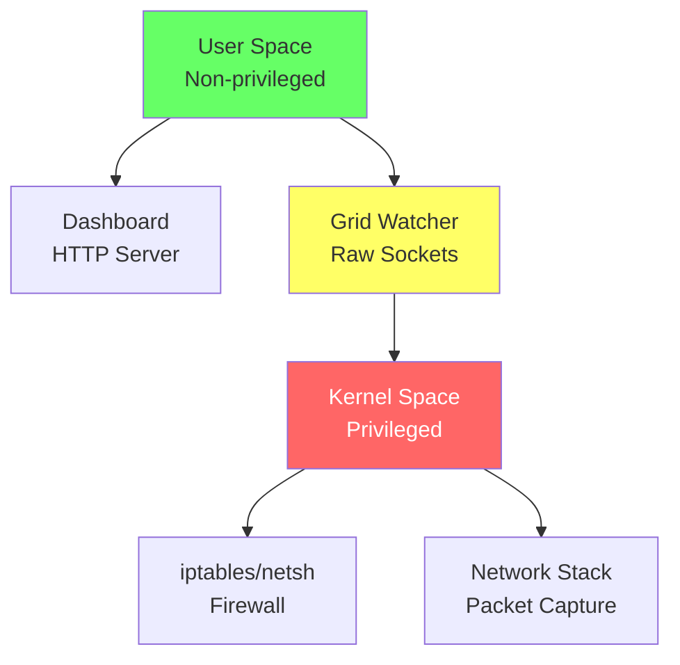

### Attack Surface

| Component | Risk | Mitigation |
|-----------|------|------------|
| Raw Socket | ⚠️ High privilege | Use capabilities, not root |
| Firewall Commands | ⚠️ System modification | Log all commands, require confirmation |
| Dashboard | ⚠️ No authentication | Deploy behind reverse proxy |
| JSON Export | ℹ️ File write | Atomic write, limited path |

---

## 🚀 Deployment Models

### Model 1: Standalone Host-Based IPS

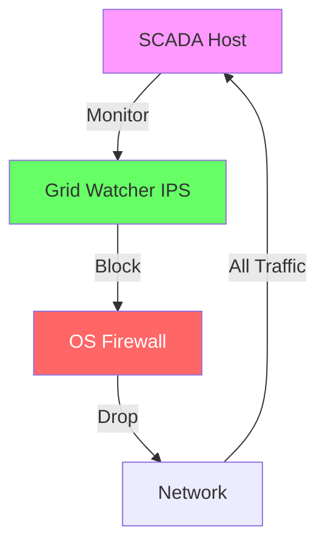

**Pros:**
- No additional hardware
- Direct packet access
- Low latency

**Cons:**
- Single point of failure
- Resource sharing with SCADA

---

### Model 2: Gateway/Jump Server Mode

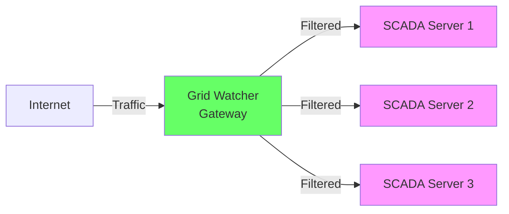

**Pros:**
- Centralized protection
- Dedicated resources
- Easier management

**Cons:**
- Additional infrastructure
- Potential bottleneck

---

## 📊 Design Principles

### 1. Fail-Safe Over Fail-Open

**Principle:** In case of failure, block traffic rather than allow it.

**Implementation:**
- Default firewall policy: DROP
- Explicit allow rules for known-good traffic
- Watchdog timer for IPS health

---

### 2. Deterministic Behavior

**Principle:** No AI/ML in critical path; predictable, rule-based detection.

**Rationale:**
- SCADA requires high reliability
- False positives unacceptable
- Auditable decision-making

---

### 3. Performance First

**Principle:** Minimize latency and resource usage.

**Optimizations:**
- Zero-copy packet handling
- Lock-free where possible
- Efficient data structures

---

## 🧪 Testing Strategy

### Unit Tests

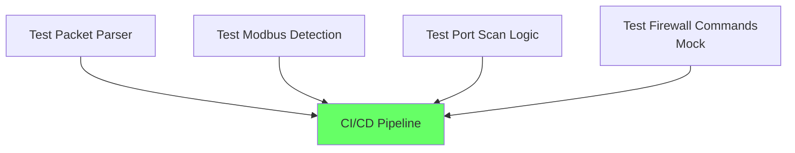

### Integration Tests

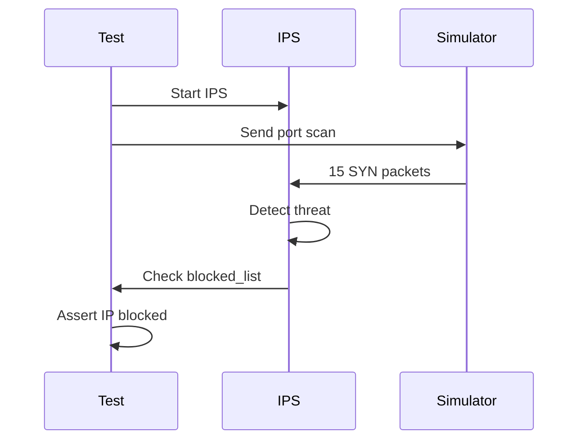

---

## 📚 Further Reading

- [QUICKSTART.md](QUICKSTART.md) - Getting started guide
- [API.md](API.md) - Detailed API reference
- [ROADMAP.md](ROADMAP.md) - Future development plans

---

**Document Version:** 1.0.0  
**Last Updated:** December 2025  
**Maintained By:** Zuudevs
