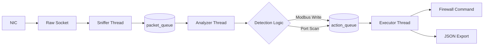

# System Architecture Documentation  
**Grid Watcher IPS**

Dokumen ini menjelaskan desain internal dan alur data dari **Grid Watcher IPS**. Sistem dirancang menggunakan pola **Producer–Consumer Pipeline** untuk memastikan performa tinggi dan *thread-safety* pada lingkungan SCADA yang sensitif.

---

## 1. High-Level Design

Grid Watcher beroperasi menggunakan **tiga thread utama** yang berjalan secara paralel dan dihubungkan melalui *thread-safe queues*.

### Pipeline Stages

1. **Packet Capture (Producer)**  
   Mengambil paket mentah langsung dari *Network Interface Card* (NIC).

2. **Analysis (Processor)**  
   Melakukan inspeksi paket (*Deep Packet Inspection*) untuk mendeteksi anomali jaringan dan protokol SCADA.

3. **Execution (Consumer)**  
   Menjalankan aksi mitigasi (pemblokiran firewall) dan pelaporan status sistem.

---

## 2. Component Details

### A. Packet Sniffer (`src/core/sniffer.cpp`)

Komponen ini bertanggung jawab untuk berinteraksi langsung dengan kernel OS.

- **Linux**  
  Menggunakan `AF_PACKET` socket dengan mode `SOCK_RAW` untuk menangkap seluruh frame Ethernet.

- **Windows**  
  Menggunakan Winsock2 (`AF_INET`, `SOCK_RAW`) dalam *compatibility mode*.

- **Mechanism**  
  Paket yang ditangkap langsung didorong ke `packet_queue` tanpa pemrosesan berat untuk meminimalkan *packet loss*.

---

### B. Packet Analyzer (`src/core/analyzer.cpp`)

Merupakan inti logika IPS yang melakukan analisis paket.

- **SCADA Detection (Modbus TCP)**  
  - Memeriksa TCP port `502`
  - Memvalidasi *Modbus Function Code*
  - Function code berbahaya:
    - `0x05` — Write Single Coil
    - `0x06` — Write Single Register
    - `0x10` — Write Multiple Registers
  - Deteksi akan memicu *security alert*

- **Port Scan Detection**  
  - Menggunakan algoritma *sliding window*
  - Melacak jumlah *destination port* unik dari satu IP sumber
  - Ambang batas default: **10 port**

---

### C. Action Executor (`src/core/executor.cpp`)

Menjalankan aksi mitigasi dan pelaporan.

- **Firewall Integration**
  - Linux:
    - `iptables -A INPUT -s <IP> -j DROP`
  - Windows:
    - `netsh advfirewall firewall add rule ...`

- **Logging**
  - Mengirim event ke `JsonExporter`
  - Digunakan oleh Web Dashboard

---

### D. JSON Exporter (`src/util/json_exporter.cpp`)

Mengelola pelaporan data ke dashboard.

- **Atomic Write Strategy**
  - Menulis ke file sementara (`.tmp`)
  - Melakukan *atomic rename* ke `dashboard_data.json`
  - Mencegah *race condition* dengan web server

---

## 3. Concurrency Model

Sistem menggunakan struktur `ThreadSafeQueue<T>` dengan:

- `std::mutex`
- `std::condition_variable`

### Queue Types

- **Packet Queue**
  - `std::vector<uint8_t>`
  - Buffer mentah paket

- **Action Queue**
  - `ActionEvent`
  - Berisi:
    - Jenis aksi
    - IP target
    - Alasan deteksi

Pendekatan ini memungkinkan *Sniffer Thread* tetap berjalan tanpa menunggu analisis selesai.

---

## 4. Data Flow Diagram

---

## 5. Error Handling & Resilience

Sistem dirancang untuk gagal secara aman (*fail-safe*) tanpa menyebabkan *crash* pada host SCADA.

### A. Graceful Shutdown

- Menangkap sinyal `SIGINT` dan `SIGTERM`
- Menggunakan global `atomic<bool> g_shutdown`

**Flow:**
1. Flag di-set ke `true`
2. Semua worker thread mendeteksi flag
3. Menyelesaikan tugas terakhir
4. Membersihkan resource
5. Shutdown aman

---

### B. Socket Reliability

- **Initialization Check**
  - Jika raw socket gagal dibuat (misalnya privilege kurang)
  - Sistem mencatat log `CRITICAL`
  - Aplikasi tidak berjalan dalam kondisi *zombie*

- **RAII (Resource Acquisition Is Initialization)**
  - Socket dan file dibungkus dalam class
  - Destructor menutup resource otomatis
  - Mencegah *memory leak* dan *resource exhaustion*

---

## 6. Performance Optimization

Dirancang agar tidak membebani sistem SCADA.

- **Lock Granularity**
  - Lock hanya untuk operasi `push/pop`
  - Analisis berat dilakukan di luar *critical section*

- **Buffer Management**
  - Buffer disesuaikan dengan MTU Ethernet
  - Menyeimbangkan memori dan throughput

- **Dashboard Efficiency**
  - JSON ditulis setiap **2 detik**
  - Atau saat *critical event*
  - Menghindari I/O berlebihan

---

## 7. Security Constraints & Limitations

1. **Privilege Level**  
   Harus dijalankan sebagai **Root (Linux)** atau **Administrator (Windows)**

2. **Protocol Support**  
   Hanya mendukung **IPv4**

3. **Encrypted Traffic**  
   Tidak dapat menginspeksi protokol terenkripsi (mis. Modbus/TLS)

4. **State Volatility**  
   Daftar IP terblokir disimpan di memori  
   Restart aplikasi akan menghapus state internal

---

## 8. Configuration & Runtime Parameters

Konfigurasi dibaca saat startup.

Parameter utama:
- Network Interface
- Port Scan Threshold
- Sliding Window Duration
- JSON Export Interval
- Firewall Auto-Block

---

## 9. Deployment Model

### A. Standalone Host-Based IPS
- Dipasang langsung pada host SCADA
- Tidak memerlukan SPAN port atau IDS hardware

### B. Gateway / Jump Server Mode
- Dipasang pada gateway SCADA
- Bertindak sebagai *last-line defense*

---

## 10. Logging & Observability

### Logging Levels
- `INFO`
- `WARNING`
- `ALERT`
- `CRITICAL`

### Event Metadata
- Timestamp
- Source IP
- Destination Port
- Detection Reason
- Action Taken

---

## 11. Threat Model Overview

### In-Scope
- Unauthorized Modbus write
- Port scanning
- Network reconnaissance
- Script-based attacks

### Out-of-Scope
- Encrypted traffic
- Zero-day exploit
- Insider threat
- Physical attack

---

## 12. Extensibility & Future Work

- IPv6 support
- Additional SCADA protocols (DNP3, IEC 104)
- Rate-based anomaly detection
- Persistent blocklist
- Metrics exporter

---

## 13. Design Philosophy

- Fail-safe over fail-open
- Low latency over deep inspection
- Transparency over magic
- Deterministic behavior over AI heuristics

---

## 14. Conclusion

Grid Watcher IPS adalah sistem proteksi jaringan ringan yang dirancang untuk lingkungan SCADA dengan fokus pada stabilitas, determinisme, dan keamanan praktis. Arsitektur modular memungkinkan pengembangan lanjutan tanpa perubahan fundamental.

---

*End of Architecture Documentation*
